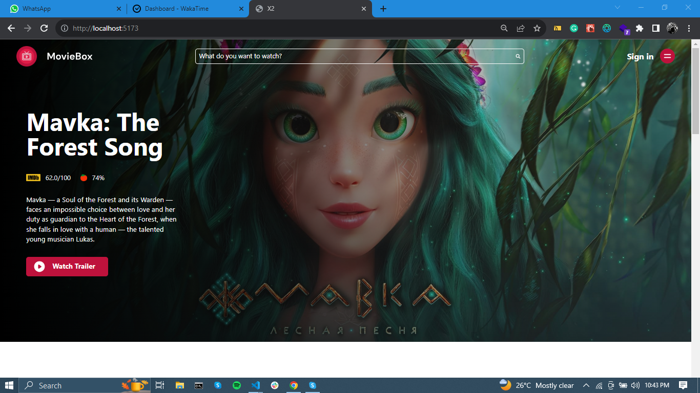

# Movie Discovery Web Application



## Table of Contents

- [Objective](#objective)
- [Features](#features)
  - [Homepage](#1-homepage)
  - [Movie Search](#2-movie-search)
  - [Movie Details Page](#3-movie-details-page)
- [Technologies Used](#technologies-used)
- [Screenshot](#screenshot)
- [Getting Started](#getting-started)
  - [Prerequisites](#prerequisites)
  - [Installation](#installation)
- [Usage](#usage)
- [API Integration](#api-integration)

## Objective

Create a feature-rich movie discovery web application that utilizes the TMDB API to enable users to search for movies, view detailed information about them, and save their favorite movies.

## Features

### 1. Homepage

- Display the top 10 movies on the homepage.
- Showcase them in an aesthetically pleasing grid layout featuring movie posters.
- Each card in the grid should include:
  - Movie poster (data-testid: movie-poster)
  - Movie title (data-testid: movie-title)
  - Release date (data-testid: movie-release-date)

### 2. Movie Search

- Implement a search feature allowing users to find movies by title.
- Present search results with:
  - Movie posters
  - Movie titles
  - Release dates
- Display a loading indicator during the search results fetching process.

### 3. Movie Details Page

- Upon navigating to "/movies/:id" route (where :id represents the movie's unique identifier), show the movie details page.
- Include the following details:
  - Movie title (data-testid: movie-title)
  - Release date (in UTC) (data-testid: movie-release-date)
  - Runtime (in minutes) (data-testid: movie-runtime)
  - Overview (data-testid: movie-overview)

## Technologies Used

This project was developed using the following technologies:

- React
- Tailwind CSS
- Vite
- Redux tookit

## Screenshot

## Getting Started

Follow these instructions to get a copy of the project up and running on your local machine.

### Prerequisites

Before you begin, ensure you have the following installed:

- Node.js: [Download and Install Node.js](https://nodejs.org/)
- npm: npm comes bundled with Node.js, but you can check if it's installed by running `npm -v` in your terminal.

### Installation

1. Clone the repository:

   ```bash
   git clone https://github.com/Oghenekparobo/x2
   ```

2. Navigate to the project directory:

```
cd x2

```

3. Install project dependencies:

```
npm install
```

### Usage

To run the project locally, use the following command:

```
npm run dev
```

### API Integration

1. To integrate the TMDB API and fetch movie data, follow these steps:

2. Create a TMDB account and obtain your API key.

3. Set your API key as an environment variable in a .env file:
   ``
   VITE_APP_TMDB_TOKEN=YOUR_API_KEY_HERE

``
